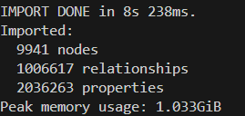

## Graph analytics on a 

## Preprocessing data
First preprocessing is done by python with pandas on preprocessing.ipynb  
...  
In this file there's also a formatting header and check for data quality to an effecienty import.
It was used neo4j-admin import for importing data to neo4j db because the size of data is very large and classical way is not enough effeciency. All this is also motivated in the [docs](https://neo4j.com/docs/getting-started/data-import/csv-import/#_ways_to_import_csv_files)

## Import data with neo4j-admin
The next steps are based by the documentations [docs](https://neo4j.com/docs/operations-manual/current/tools/neo4j-admin/neo4j-admin-import/#import-tool-full) and [this tutorial](https://neo4j.com/docs/operations-manual/current/tutorial/neo4j-admin-import/)

### To import data

Start docker:
```
docker compose -d
```

Go to the container's shell

```
 docker exec -it neo4j_server /bin/bash
```

After that, you can use neo4j-admin command 
```
neo4j-admin database import full movies --overwrite-destination --id-type=integer --nodes import/users.csv import/movies.csv import/genres.csv --relationships import/ratings.csv import/movies_genres.csv
```

Restart docker container and you will see movies database with data.

After that the result output should be that:  


For consistency check you can run this command:
```
neo4j-admin database check neo4j
```

## Neo4j Graph Analytics
#### Little tips
Drop all index and constraints
```
CALL apoc.schema.assert({},{},true) YIELD label, key
RETURN *
```
Drop data 
```
MATCH (n) DETACH DELETE n;
```


FUNZIONAAA
# TODO: capire come formattare le date
# TODO: capire come accedere al db dopo l'import
# guarda gemini
# ricorda di savare i file risultanti dal notebook e non far girare sempre la stessa roba
# TODO: change string to datetime header

# TODO: change files to import

## for permission problem on data dir (probably only wsl users)
"""
sudo chmod -R 777 import_to_docker
"""
## Cities
The dataset is picked from https://grouplens.org/datasets/movielens/latest/

You can download the datasets [here](https://files.grouplens.org/datasets/movielens/ml-1m.zip)

